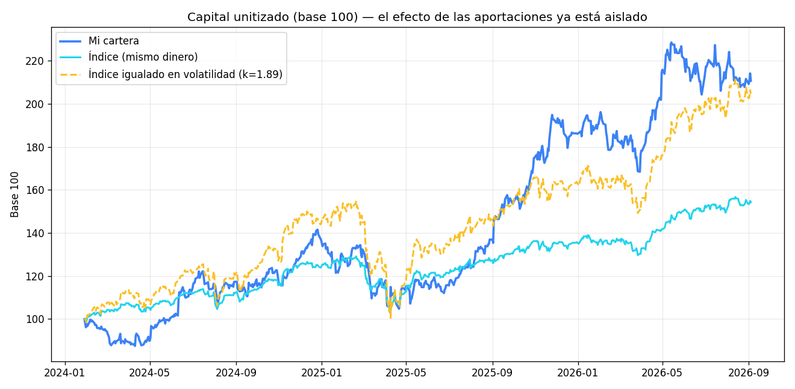
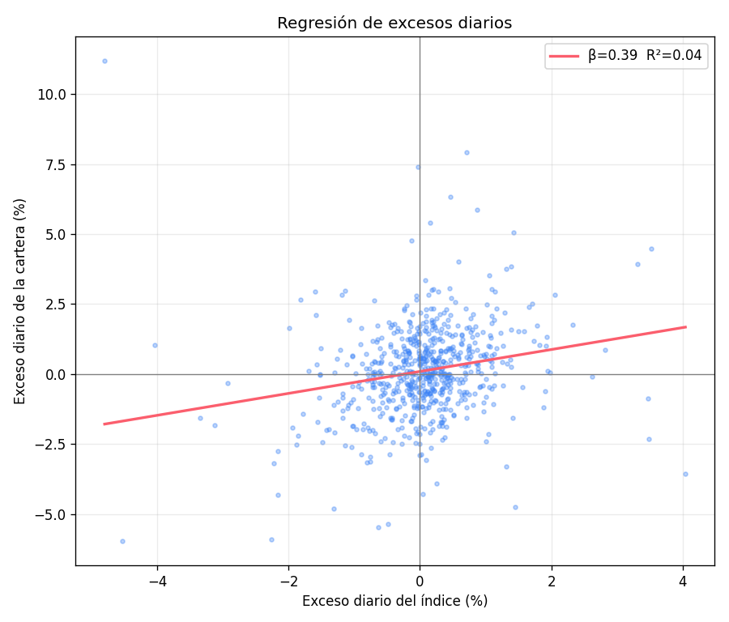
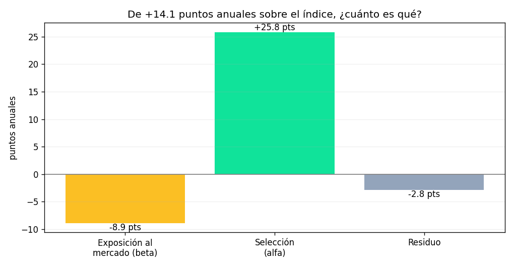

# ¿Queda selección en la cartera tras descontar el riesgo?

Ejecución del pre-registro `docs/preregistro_alfa_beta.md` (commit `500bf9b`),
escrito antes de ver ningún número de este informe.

Cartera: AAPL 500 € (2024-01-27), GOOG 800 € (2025-04-03), NVDA 250 €
(2026-01-15). Benchmark 40% S&P 500 / 60% MSCI World, de flujos igualados.
672 sesiones. Tipo libre de riesgo: `XEON.DE` (€STR de acumulación, en EUR).

---

## VEREDICTO: insuficiente evidencia de selección

| Criterio pre-registrado | Resultado |
|---|---|
| **(a)** IC del 95% del alfa por encima de 0 | **NO** — `[−3,91 · +67,23]` |
| **(b)** Bate al índice igualado en volatilidad | SÍ — por 1,42 puntos |
| **(c)** Sobrevive a excluir la mayor posición | **NO** — se da la vuelta |

Fallan dos de las tres. **No hay evidencia de que la selección aporte nada por
encima de haber asumido más riesgo.** No es «casi»: es que la muestra no permite
afirmarlo.

---

## MEDIDO

### El bruto, que es el que engaña

Invertido 1.550 € · cartera **2.753 €** · índice **2.117 €** · diferencia
**+635 €**. Un +30% sobre el índice, que es el número que apetece mirar.

### El índice igualado en volatilidad

| | Cartera | Índice | Índice igualado |
|---|---|---|---|
| Volatilidad anual | **25,75%** | 13,60% | 25,75% |
| CAGR | **32,25%** | 17,66% | **30,83%** |

`k = 1,894`: la cartera lleva **casi el doble de riesgo** que el índice. Al
igualar ese riesgo, la ventaja de +14,6 puntos de CAGR se reduce a **+1,42**.

**El 90% del exceso lo explica el riesgo asumido, no la selección.**

### CAPM

| Métrica | Valor |
|---|---|
| Alfa anualizado | +25,77% |
| **IC 95% (bootstrap por bloques)** | **[−3,91 · +67,23]** |
| Beta | 0,392 · IC [0,087 · 0,701] |
| **R²** | **0,043** |
| Information Ratio | 0,531 |
| Tracking error | 26,52% |

### Descomposición del exceso

De **+14,1 puntos** anuales sobre el índice: **−8,9** por exposición al mercado,
**+25,8** atribuidos a selección, **−2,8** de residuo.

### Concentración

| | |
|---|---|
| Herfindahl sobre \|alfa\| | **0,798** |
| **Posiciones efectivas** | **1,25** |
| Mayor posición | GOOG, +565 € |
| **Cuota de GOOG** | **89,0%** |

### Sin GOOG

| | Con GOOG | Sin GOOG |
|---|---|---|
| Alfa anual | +25,77% | +13,67% |
| IC 95% | [−3,91 · +67,23] | [−14,56 · +50,33] |
| CAGR cartera | 32,25% | **18,57%** |
| CAGR índice igualado | 30,83% | **28,69%** |
| **Diferencia** | **+1,42** | **−10,12** |

**Sin su mejor posición, la cartera pierde contra el índice igualado en riesgo
por 10 puntos anuales.**

---

## INTERPRETACIÓN

**Me equivoqué en la predicción del pre-registro, y conviene decirlo.** Escribí
que «la beta será alta». Salió **0,392**, baja. La razón está en el **R² de
0,043**: el índice explica apenas el **4%** de los movimientos de la cartera. Con
tres valores concentrados, casi todo es idiosincrático.

Y eso tiene una consecuencia incómoda para el propio análisis: **con un R² de
0,04, el reparto entre alfa y beta no es de fiar**. La regresión apenas encuentra
relación con el mercado, así que el «+25,8 de selección» es en buena medida el
cajón donde va a parar todo lo que el modelo no explica. Es exactamente por eso
que el criterio no se apoyaba solo en el alfa.

**Los dos criterios que sí son robustos apuntan en la misma dirección.** El
vol-matched no depende de ninguna regresión: escala el índice a la volatilidad
observada y compara. Da +1,42 puntos, dentro del ruido. Y al quitar GOOG se da la
vuelta a −10,12.

**El edge cuelga de un nombre.** 1,25 posiciones efectivas no es una cartera: es
una apuesta con dos acompañantes. GOOG concentra el 89% del alfa. Que GOOG haya
salido bien es un hecho; que eso demuestre capacidad de selección es una
inferencia que estos datos no sostienen.

**Lo que sí se puede afirmar:** la cartera ha rendido más que el índice. **Lo que
no:** que sea por elegir mejor y no por haber asumido casi el doble de riesgo en
tres nombres.

---

## Gráficas

*El índice igualado en volatilidad (naranja) termina casi donde la cartera
(azul). La distancia entre ambos es todo el alfa que hay; la distancia con el
índice simple (cian) es sobre todo riesgo.*

*La nube es prácticamente redonda: R² de 0,043. El índice no explica lo que hace
esta cartera.*

---

## Límites

- **n = 3 posiciones.** Cualquier lectura de sección cruzada sobre tres nombres
  es anecdótica.
- **~2,6 años y un solo régimen**, mayoritariamente alcista.
- **R² de 0,043**: la descomposición alfa/beta es poco informativa, y así se
  reporta en vez de presentarla como si el modelo ajustara.
- **El vol-matched es una lente, no una estrategia.** Un ETF no se apalanca al
  tipo libre de riesgo sin coste ni garantías, y el reajuste diario del
  apalancamiento tiene un arrastre por volatilidad que esto no modela. Si se
  incluyera, el listón sería algo más bajo y la cartera saldría algo mejor
  parada — pero no lo suficiente para cambiar el veredicto, que falla por (a) y
  (c), no por (b).
- **Sesgo de supervivencia del propio inversor**: la cartera contiene lo que se
  compró y se mantuvo, no lo que se vendió por el camino.

## Qué haría falta para responder que sí

Más posiciones y más tiempo. Con 1,25 posiciones efectivas y 2,6 años, ningún
método puede distinguir habilidad de suerte: el intervalo del alfa mide 71 puntos
de ancho. El **registro forward** (`jobs/congelar_decisiones.py`) va acumulando
observaciones precisamente para esto.
