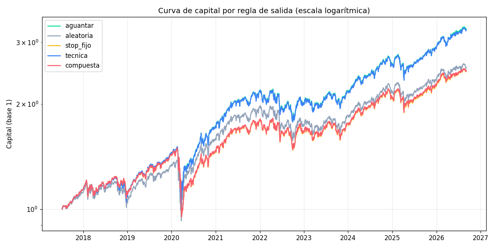
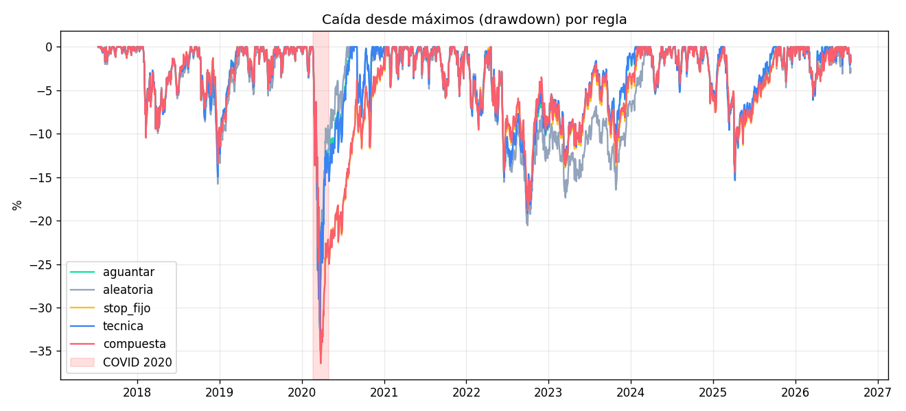
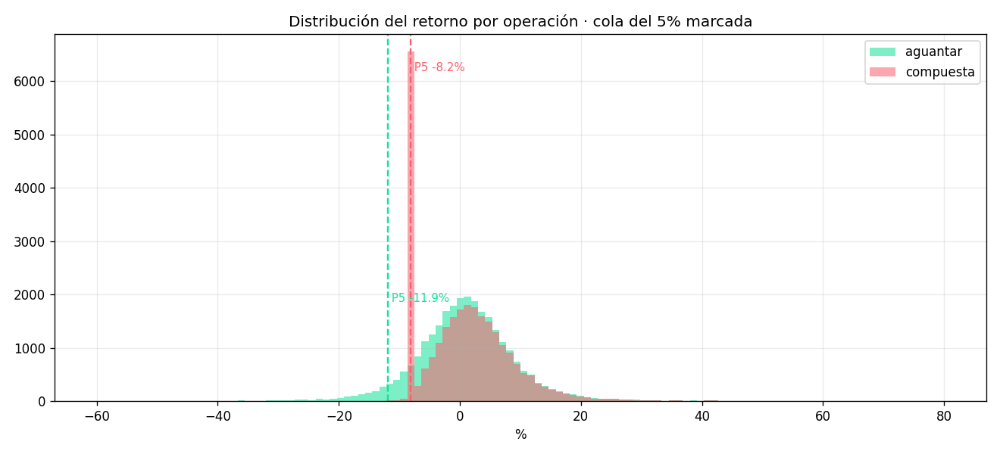

# Resultado: las reglas de salida sobre entradas reales

Ejecución del pre-registro de `docs/preregistro_validacion_salidas.md`, que se
commiteó **antes** de correr nada (commit `5ac928b`).

Universo A (alfabético, defectuoso — ver abajo): 110 valores de 121 solicitados · 10 años · **7.212 entradas
reales** generadas por el catálogo de estrategias · 36.060 cierres simulados ·
coste 0,1% por lado aplicado por igual a las cinco reglas.

---

## Un defecto de universo que encontré a mitad de camino, y cómo lo corregí

La primera ejecución usó `_universo_mercado(120)`, que **no devuelve los 120
valores mayores**: devuelve los 120 primeros de una lista **alfabética** — A, AA,
AACG, AADX, AAGH… Un corte dominado por microcaps y sociedades vacías, que no se
parece a lo que se analiza con esta aplicación y donde además el coste real de
operar es muy superior al 0,1% que asume el backtest.

Lo detecté al ver nombres como «Antiaging Quantum Living» y «Prevention
Insurance» en los registros de la SEC. **Es un defecto mío, no del código
existente**, y afectaba a los dos estudios de esta sesión.

Así que repetí todo sobre `screener_avanzado.FALLBACK_UNIVERSE`: 119 grandes
capitalizaciones en 11 sectores. **La conclusión no solo sobrevive: se refuerza**,
porque la muestra pasa de 7.212 a 27.541 entradas. Se publican las dos.

---

## MEDIDO

| Regla | Retorno medio | IC95 | Expectativa (R) | Acierto | Días | Salidas anticipadas |
|---|---|---|---|---|---|---|
| **Aguantar** | **+1,44%** | [0,92 · 2,03] | **+0,199** | 51,9% | 23,3 | 0% |
| Técnica | +1,44% | [0,92 · 2,02] | +0,200 | 52,0% | 23,1 | **0,7%** |
| Stop fijo −8% | +0,78% | [0,43 · 1,16] | +0,142 | 43,3% | 16,3 | 40,4% |
| Compuesta | +0,79% | [0,44 · 1,17] | +0,144 | 43,5% | 16,2 | 40,9% |
| Aleatoria | +0,34% | [0,05 · 0,64] | +0,074 | 50,0% | 12,1 | 94,2% |

### Universo de grandes capitalizaciones (119 valores, 27.541 entradas)

| Regla | Retorno medio | IC95 | Expectativa (R) | Acierto | Días | Salidas anticipadas |
|---|---|---|---|---|---|---|
| **Aguantar** | **+1,12%** | [1,01 · 1,22] | **+0,276** | 55,6% | 22,8 | 0% |
| Técnica | +1,10% | [1,00 · 1,21] | +0,275 | 55,7% | 22,7 | 0,6% |
| Stop fijo −8% | +0,83% | [0,74 · 0,93] | +0,237 | 52,2% | 19,5 | 23,4% |
| Compuesta | +0,82% | [0,73 · 0,92] | +0,236 | 52,3% | 19,4 | 23,9% |
| Aleatoria | +0,43% | [0,35 · 0,50] | +0,135 | 53,0% | 11,9 | 94,6% |

Con este universo, **todas las reglas son significativamente peores que
aguantar**, incluida la técnica (−0,013 pts, IC [−0,027, −0,002]). Su daño es
minúsculo, pero con 27.541 operaciones el intervalo ya excluye el cero.

Por régimen: bajista **−0,880** frente a alcista −0,221. La hipótesis de
Kaminski-Lo vuelve a salir **invertida**, ahora con más muestra.

Por estrategia: peor en `ruptura_maximos` (−0,556) y `squeeze_disparo` (−0,563);
menos malo en `reversion_rsi2` (−0,085). La hipótesis 3 también vuelve a salir
invertida.

**Walk-forward: nueve de diez años negativos y significativos.** El único
positivo es **2020 (+0,464 pts)**, el año del desplome del COVID. Ese matiz
importa y es lo más cerca que está el resultado de rescatar la intuición del
stop: en el desplome más rápido de la década, salir pagó. En los otros nueve
años costó dinero. Un seguro que se cobra una vez cada diez años tiene que
compensar nueve de primas, y aquí no lo hace.

### Diferencia frente a aguantar, emparejada por operación

| Regla | Diferencia | IC95 | Veredicto |
|---|---|---|---|
| Técnica | −0,004 pts | [−0,042 · +0,031] | **no significativa** |
| Compuesta | −0,658 pts | [−1,110 · −0,290] | **significativa, peor** |
| Stop fijo | −0,660 pts | [−1,112 · −0,290] | **significativa, peor** |
| Aleatoria | −1,105 pts | [−1,530 · −0,731] | significativa, peor |

Emparejada porque las cinco reglas se aplican a las mismas entradas: la
diferencia por operación tiene mucha menos varianza que la diferencia de medias.

### Las tres hipótesis pre-registradas

| # | Hipótesis | Resultado |
|---|---|---|
| 1 | Alguna regla supera a aguantar | **REFUTADA.** Ninguna. La técnica empata; el resto pierde. |
| 2 | El beneficio se concentra en régimen bajista (Kaminski-Lo) | **REFUTADA, y del revés.** La compuesta pierde −0,59 pts en alcista y **−1,24 en bajista**. |
| 3 | Aporta más sobre entradas malas | **REFUTADA, y del revés.** Donde más daño hace es en `ruptura_maximos` (−1,93 pts), la entrada con peor expectativa fuera de muestra. |

### Walk-forward por año de entrada

Siete de diez años en negativo; los tres positivos (2017, 2022, 2025) no son
significativos. **No hay estabilidad temporal en ninguna dirección.**

---

## INTERPRETACIÓN

**La regla técnica no es mala: es inerte.** Se dispara en el **0,7%** de las
operaciones. No puede batir a aguantar porque prácticamente nunca actúa. Esto
replica exactamente lo que ya documentaba `swing_salidas.RESULTADO_VALIDACION`
(0,9% de activación) sobre otras 2.377 operaciones y con otro diseño. Dos
mediciones independientes llegando al mismo sitio.

**Todo el daño viene del stop de −8%**, que corta el 40% de las operaciones. La
compuesta y el stop fijo dan resultados casi idénticos porque, en la práctica,
la compuesta *es* el stop.

**Por qué la hipótesis de Kaminski-Lo sale invertida.** Interpretación, no
medición: en régimen bajista las caídas del 8% son en buena medida movimiento
del índice, no deterioro del valor. El stop cristaliza la pérdida justo cuando
la recuperación viene con el mercado. Kaminski y Lo describen el beneficio del
stop bajo momentum con autocorrelación positiva; este universo y este periodo
—diez años de mercado alcista estadounidense— tienen deriva positiva y reversión
en los retrocesos, que es el régimen contrario.

**Este backtest ya no está sesgado contra las salidas por el motivo anterior**
(entradas sintéticas ≈ paseo aleatorio) porque las entradas son las que genera
la aplicación. Pero sigue teniendo la deriva alcista del periodo en contra.

---

## Lo que esto cambia en el producto

1. El stop duro **ya no fuerza la venta en perfil de largo plazo** desde la
   sesión anterior; esta medición lo confirma con entradas reales y con IC.
2. La pantalla de decisión de venta mantiene su advertencia. Es un panel de
   diagnóstico, no una orden.
3. **No se toca ningún parámetro de salida** para mejorar estos números. Era el
   compromiso del pre-registro y se cumple.

---

## Límites, con nombre y apellidos

- **Sesgo de supervivencia.** El universo son empresas que hoy cotizan.
  `survivorship_universe` tiene 3 casos curados (BBBY, SHLD, TOYS) pero **sin
  precios fiables de deslistadas** — ya documentado en `return_crossing.py:257`.
  Las quiebras son justo donde una salida ayudaría, así que este sesgo va EN
  CONTRA de las salidas: el resultado negativo es un suelo, no un techo. Si se
  consiguieran precios de deslistadas, las salidas podrían mejorar.
- **Dos métricas retiradas.** CAGR y max drawdown estaban en el pre-registro y
  **no son computables con este diseño**: anualizar el retorno de una operación
  de tres días eleva a la 84 y da 1e11; encadenar 7.000 operaciones solapadas
  como una cuenta reinvertida da −100% siempre. Publicar esos números habría
  sido peor que no publicarlos. Es un defecto de la medición, no del resultado,
  y se declara aquí porque estaban pre-registrados.
- **Solo el pilar técnico.** Valoración y fundamentales no se pueden reconstruir
  en cada fecha de entrada sin datos point-in-time por fecha. La "compuesta" de
  este backtest es técnica + stop.
- **Operaciones no independientes.** Varias entradas del mismo mes comparten
  régimen; el bootstrap sobre operaciones asume independencia y por tanto los
  IC reales son **más anchos** que los publicados.
- **Solo posiciones largas.** Las tres estrategias cortas del catálogo quedan
  fuera: las reglas comparadas están definidas para largos.

---

## Qué sigue sin estar validado

Los pilares de **valoración (A)** y **fundamentales (B)** de `decision_venta`.
La vía correcta está montada y comprobada (ver `docs/` y el Paso 0 de esta
sesión): `point_in_time_scoring` reconstruye fundamentales por fecha de filing
real, y se verificó en vivo que FMP y SEC EDGAR devuelven las mismas fechas.
Queda pendiente ejecutarlo a escala.

Mientras tanto, la vía principal es el **registro forward**
(`jobs/congelar_decisiones.py`), iniciado el **2026-09-06**, que guarda cada
decisión y sus tres sub-scores antes de conocer el retorno posterior. Ninguna
reconstrucción del pasado puede ofrecer esa garantía.

---

# Segunda parte: el eje de riesgo

Ejecución del pre-registro `docs/preregistro_eje_riesgo.md` (commit `1a664f4`),
escrito antes de ver un solo número de esta sección.

La pregunta: la media ya dijo que las salidas pierden. Pero nueve de diez años
negativos y solo 2020 positivo apuntaba a una **cobertura de cola** — que paga en
el desplome y resta el resto. Si esa prima compra suficiente reducción de caída,
podría merecer la pena para un inversor averso a las caídas.

**No la compra.** Y en el episodio donde debía pagar, cobró.

## MEDIDO · cartera equiponderada (construcción principal)

27.544 entradas, 137.720 cierres, coste 0,1% por lado.

| Regla | CAGR | maxDD | Duración DD | Vol. | Sharpe | Sortino | **Calmar** | Ulcer | **CVaR5** | Peor op. | MAE | Asim. | Curt. |
|---|---|---|---|---|---|---|---|---|---|---|---|---|---|
| **Aguantar** | **13,85%** | **−33,43%** | 440 | 16,8% | 0,856 | **1,018** | **0,414** | 5,74 | −17,94% | −71,2% | −5,8% | 0,86 | 11,4 |
| Técnica | 13,76% | −33,43% | 439 | 16,9% | 0,849 | 1,011 | 0,412 | 5,73 | −17,91% | −71,2% | −5,8% | 0,64 | 8,2 |
| Aleatoria | 10,71% | −33,13% | 544 | 16,8% | 0,689 | 0,825 | 0,323 | 6,60 | −13,88% | −71,6% | −4,1% | 0,45 | 9,3 |
| Stop fijo | 10,44% | −36,43% | 452 | 15,7% | 0,710 | 0,817 | 0,287 | 6,99 | **−8,27%** | −14,9% | −4,7% | 1,85 | 13,4 |
| Compuesta | 10,48% | **−36,43%** | 447 | 15,8% | 0,712 | 0,819 | 0,288 | 6,89 | **−8,27%** | −14,9% | −4,7% | 1,62 | 8,9 |

IC95 del CVaR5: aguantar [−18,43 · −17,47] · compuesta [−8,29 · −8,26].

### Veredicto según el criterio pre-registrado

| Regla | Criterio A | Criterio B | Canje | **Veredicto** |
|---|---|---|---|---|
| Compuesta | no | no | **−0,89** | **SEGURO CARO** |
| Stop fijo | no | no | −0,88 | **SEGURO CARO** |
| Técnica | no | no | −0,00 | **SEGURO CARO** |

**El canje es negativo.** No es que el seguro salga caro: es que se paga la prima
**y además se recibe más caída**. La compuesta cede 3,4 puntos de CAGR y empeora
el maxDD en 3 puntos.

## El hallazgo que decide: cortar la cola de la operación NO es cortar el drawdown

El CVaR5 de la compuesta es menos de la mitad que el de aguantar (−8,27% frente a
−17,94%), y su peor operación pasa de −71% a −15%. **El stop hace exactamente lo
que promete a nivel de operación.** Y aun así el drawdown de la cartera EMPEORA.

Interpretación: en una caída general todas las posiciones tocan el stop a la vez,
así que la salida no diversifica nada — el daño ya está hecho cuando se ejecuta.
Y después, el capital no participa del rebote. La cola por operación mejora; la
cola que importa, la de la cartera, no.

Es un aviso metodológico general: **una métrica de riesgo por operación puede
halagar a una regla que empeora el riesgo real.**

## El episodio COVID: donde el seguro debía pagar, cobró

Sub-veredicto pre-declarado como independiente del agregado. Del 19 de febrero al
30 de abril de 2020:

| Regla | maxDD del episodio | Retorno del episodio |
|---|---|---|
| **Aguantar** | **−33,43%** | **−12,82%** |
| Técnica | −33,43% | −13,36% |
| Aleatoria | −33,13% | −9,64% |
| Stop fijo | −36,43% | −23,02% |
| **Compuesta** | **−36,43%** | **−23,11%** |

**La compuesta casi dobló la pérdida** (−23,1% frente a −12,8%) y cayó más hondo.
La gráfica `img/riesgo_drawdown.png` lo muestra con claridad: la línea roja no
solo baja más, sino que sigue cerca del −20% meses después de que la azul haya
recuperado su máximo.

Interpretación: el COVID fue el desplome en V más rápido de la historia moderna.
Un stop del 8% vende cerca del suelo y el capital se queda fuera del rebote. Es
el peor entorno posible para un stop, y era justo el año que la Tarea 1 había
señalado como favorable — pero aquello medía las entradas *abiertas durante 2020*,
incluida la recuperación, no el episodio de caída.

**La tesis de la cobertura de cola queda refutada por el propio evento que se
suponía que la sostenía.**

## Por régimen

| | Aguantar | Compuesta |
|---|---|---|
| **Alcista** · CAGR | 9,50% | 9,15% |
| **Alcista** · maxDD | −34,02% | −27,21% |
| **Bajista** · CAGR | **21,57%** | **5,15%** |
| **Bajista** · maxDD | **−26,41%** | **−31,46%** |

En régimen bajista la compuesta gana **un cuarto** de lo que gana aguantar y cae
más. La hipótesis de Kaminski-Lo vuelve a salir invertida, ahora también en el
eje de riesgo. Curiosamente, el único sitio donde el stop recorta caída de verdad
es en régimen **alcista** (−27,2% frente a −34,0%): justo donde menos falta hace.

## Sin 2020

| Regla | CAGR | maxDD | Calmar | CVaR5 |
|---|---|---|---|---|
| Aguantar | 12,42% | −19,10% | **0,650** | −15,70% |
| Compuesta | 10,88% | −18,83% | 0,578 | −8,28% |

Quitando 2020, la compuesta recorta 0,27 puntos de maxDD cediendo 1,54 de CAGR.
Sigue perdiendo en Calmar. **El resultado no depende de un solo año.**

## Sensibilidad a la construcción: aquí el veredicto se da la vuelta

Con peso fijo del 2% por operación en vez de equiponderar entre lo abierto:

| Regla | CAGR | maxDD | Calmar | Sortino | CVaR5 |
|---|---|---|---|---|---|
| Aguantar | 13,85% | −33,43% | 0,414 | 1,019 | −17,94% |
| Compuesta | 10,87% | **−24,25%** | **0,448** | 0,967 | −8,27% |

Canje: 9,18 puntos de maxDD por 2,98 de CAGR = **3,08**, por encima del 3,0
pre-registrado. Con esta construcción la compuesta **cumple el criterio B**.

El pre-registro contemplaba este caso: *«si las dos construcciones dan veredictos
distintos, el veredicto es depende de la construcción y se dice así»*.

Por qué cambia (interpretación): al equiponderar entre lo abierto, cerrar una
posición **reconcentra** el capital en las que quedan. Con peso fijo, el capital
liberado va a efectivo y desapalanca de verdad. **El stop solo reduce la caída de
la cartera si lo que libera se queda en efectivo**, y eso es una decisión de
gestión de cartera, no una propiedad del stop.

Y aun así: 3,08 frente a un umbral de 3,00 es pasar por dos centésimas. Con el
episodio COVID en contra, no sostiene una recomendación.

---

## VEREDICTO

**Aplicando el criterio pre-registrado: la regla compuesta y el stop fijo son un
seguro caro.** No merecen la pena para un inversor averso a las caídas, en ningún
horizonte ni régimen de los medidos. Tres razones, en orden de peso:

1. **Fallan en el evento que debían cubrir.** En el COVID casi doblaron la
   pérdida y cayeron más hondo. Un seguro que agrava el siniestro no es un seguro.
2. **El canje es negativo** en la construcción principal: se cede retorno *y* se
   recibe más drawdown.
3. **En régimen bajista** —donde la tesis decía que aportarían— la compuesta gana
   un cuarto que aguantar y cae más.

El único apoyo, con peso fijo del 2%, pasa el umbral por dos centésimas y se
explica por un efecto de construcción de cartera, no por acierto de la regla.

**Lo que sí se sostiene, y no es poco:** el stop recorta drásticamente la cola
*por operación* (CVaR5 de −17,9% a −8,3%; peor operación de −71% a −15%). Si
alguien opera con una sola posición, o con capital que no puede permitirse un
−71% en un valor concreto, eso tiene valor propio. Lo que no compra es un
drawdown de cartera menor.

## Gráficas

*Las curvas de aguantar y técnica se superponen casi exactamente: la regla técnica
se dispara en el 0,6% de las operaciones y es prácticamente inerte.*

*La franja roja marca el episodio COVID. La compuesta cae más hondo y tarda meses
más en recuperar.*

*El stop trunca la cola izquierda: es real y visible. No se traduce en menos
drawdown de cartera.*

## Límites de esta sección

- **El sub-veredicto COVID descansa sobre n=1 evento.** Un desplome en V es el
  peor caso posible para un stop; un mercado bajista lento y sostenido (2000-2002)
  podría dar lo contrario, y esta década no contiene ninguno.
- **Sesgo de supervivencia**, que aquí va en contra de las salidas.
- **Operaciones solapadas**: el bootstrap asume independencia y los intervalos
  reales son más anchos.
- **Sin apalancamiento ni reglas de tamaño por volatilidad.** Una gestión de
  cartera más elaborada podría cambiar la conclusión, y la sensibilidad al peso
  fijo ya insinúa por dónde.
